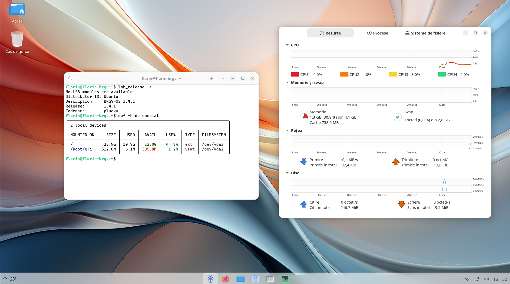

# BRGV-OS 

[](LICENSE) 


**BRGV-OS** is based by [AnduinOS](https://www.anduinos.com/) (project source code is [here](https://github.com/Anduin2017/AnduinOS)), is a custom Ubuntu-based Linux distribution.



## How to build

It is suggested to use Ubuntu or other based by this Linux distribution. Modify the file `makefile` in concordance with your Linux distribution. 

To build the OS, run the following command:

```bash
make
```
But before edit the build parameters for your needs, modify the `./src/args.sh` file.

For specific languages look in `./mods` and then run command (example for Romanian language):

```bash
make ro_RO
```

This command modify `./src/args.sh` with parameters from `./mods/ro_RO.json` for you.

That's it. The built file will be an ISO file in the `./src/dist` directory.

Test ISO file result in virtual machine.
Next video is a example...  

[](https://www.youtube.com/embed/Belj3ji7XQ8)


## License

This project is licensed under the GNU GENERAL PUBLIC LICENSE - see the [LICENSE](LICENSE) file for details

## Warning 

The open-source software included in **BRGV-OS** is distributed in the hope that it will be useful, but **WITHOUT ANY WARRANTY**.
